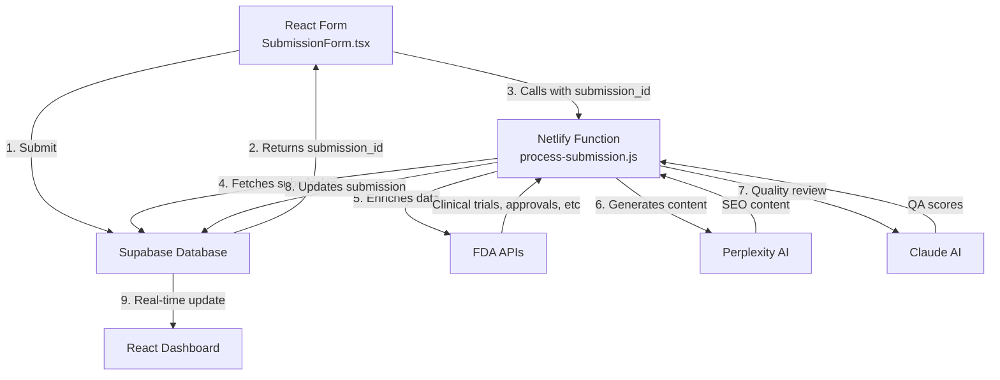

# Current Form Submission Infrastructure

## Overview
The form submission system is fully integrated with Supabase and uses Netlify Functions for processing.

## Architecture Flow



## Current Implementation

### 1. **Form Component** (`/src/components/SubmissionForm.tsx`)
- Collects pharmaceutical product information
- Creates record directly in Supabase
- Triggers Netlify function for AI processing

### 2. **Supabase Connection**
- **URL**: `https://ktchrfgkbpaixbiwbieg.supabase.co`
- **Tables**: `submissions`
- **Authentication**: Using anon key (public client access)
- **Real-time**: Enabled for dashboard updates

### 3. **Netlify Function** (`/netlify/functions/process-submission.js`)
Handles the complete processing pipeline:
- FDA data enrichment (ClinicalTrials.gov, Drugs@FDA, FAERS)
- Perplexity AI content generation
- Claude AI quality review
- Database updates

### 4. **Environment Variables** (in Netlify)
```
VITE_SUPABASE_URL=https://ktchrfgkbpaixbiwbieg.supabase.co
VITE_SUPABASE_ANON_KEY=eyJhbGc...
PERPLEXITY_API_KEY=pplx-qETx...
CLAUDE_API_KEY=sk-ant-api03-...
```

## Data Flow

1. **User fills form** → React state management
2. **Form submission** → Direct Supabase insert
3. **Get submission ID** → Returned from Supabase
4. **Trigger processing** → Call Netlify function with ID
5. **Fetch full record** → Function reads from Supabase
6. **Enrich with FDA data** → Multiple API calls
7. **Generate SEO content** → Perplexity AI
8. **Quality review** → Claude AI
9. **Update database** → All results saved
10. **Dashboard updates** → Real-time via Supabase subscriptions

## Key Features

### ✅ Working
- Direct Supabase connection from React
- Form submission creates records
- Netlify function processes submissions
- AI content generation (Perplexity)
- FDA data enrichment
- Real-time dashboard updates

### ⚠️ Issues to Fix
- Claude QA integration (scores not saving properly)
- Some database columns might be missing
- Workflow stage constraints

## Testing the Flow

1. **Submit a form**: https://3cubed-seo.netlify.app/seo-requests
2. **Check processing**: Watch browser console for logs
3. **View results**: https://3cubed-seo.netlify.app/seo-review

## Database Schema (Current)
```sql
submissions table:
- id (uuid)
- product_name (text)
- generic_name (text)
- indication (text)
- therapeutic_area (text)
- seo_title (text) - AI generated
- meta_description (text) - AI generated
- seo_keywords (text[]) - AI generated
- h2_tags (text[]) - AI generated
- ai_output (jsonb) - Full AI response
- qa_score (integer) - Claude QA score
- workflow_stage (text)
- ai_processing_status (text)
- ... many other fields
```

## Next Steps
1. Verify all required database columns exist
2. Fix workflow_stage constraints if needed
3. Test Claude API integration
4. Add error handling for failed API calls