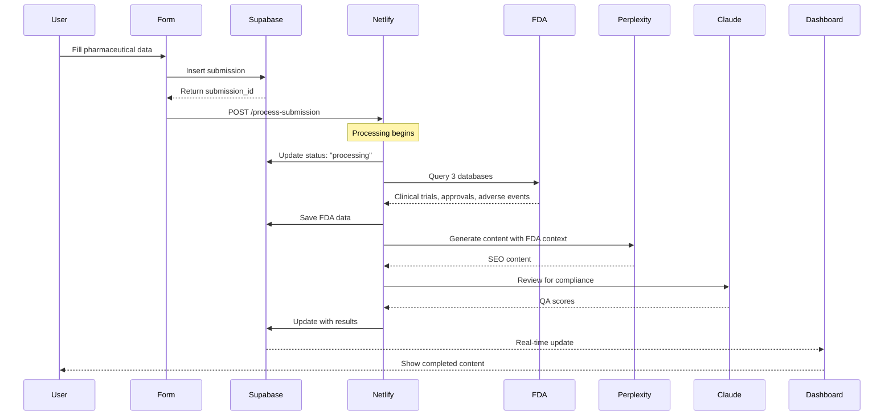
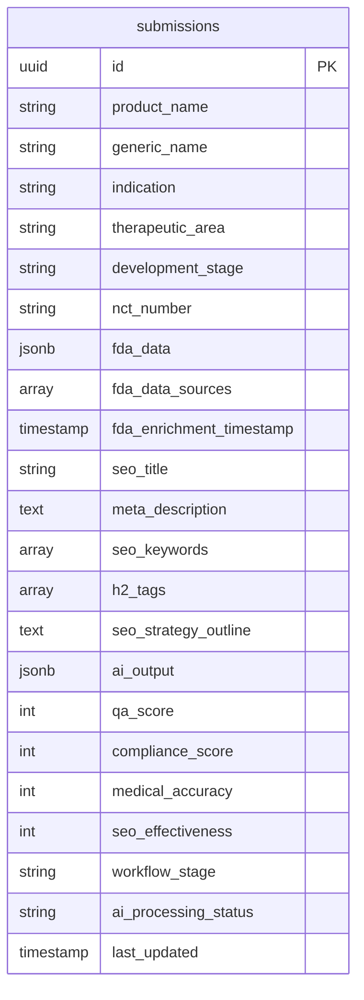
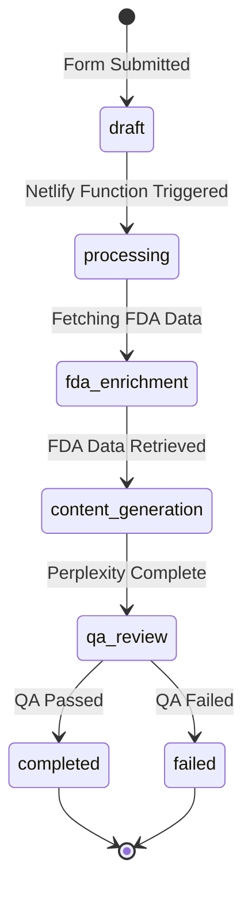
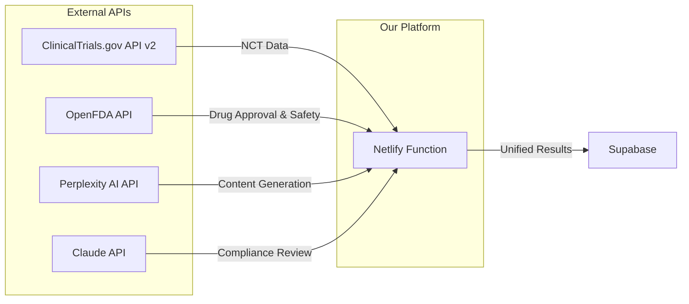
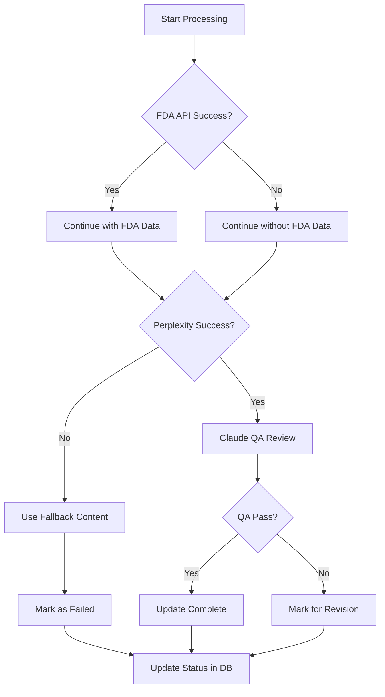
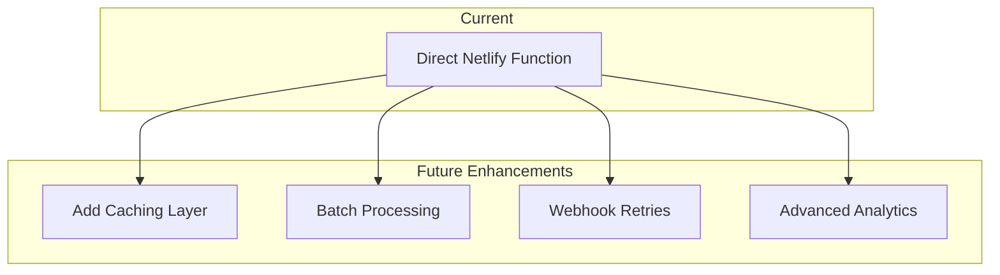

# 3Cubed SEO Platform - Data Flow Architecture

## Current Implementation (with FDA Integration)

```mermaid
graph TB
    subgraph "Frontend - React App"
        A[SEO Request Form] -->|Submit| B[Form Validation]
        B -->|Valid| C[Save to Supabase]
    end
    
    subgraph "Database - Supabase"
        C -->|Insert| D[(submissions table)]
        D -->|Real-time| E[Dashboard Updates]
        D -->|Webhook| F[Netlify Function]
    end
    
    subgraph "Processing - Netlify Function"
        F -->|1. Fetch| G[Get Submission Data]
        G -->|2. Enrich| H[FDA API Integration]
        
        subgraph "FDA Data Sources"
            H --> I[ClinicalTrials.gov]
            H --> J[Drugs@FDA]
            H --> K[FAERS Adverse Events]
        end
        
        H -->|3. Generate| L[Perplexity AI]
        L -->|4. Review| M[Claude QA]
        M -->|5. Update| D
    end
    
    subgraph "Real-time Updates"
        D -.->|Subscription| N[Dashboard Component]
        N -->|Display| O[Live Progress]
    end
    
    style A fill:#4CAF50
    style D fill:#2196F3
    style H fill:#FF9800
    style L fill:#9C27B0
    style M fill:#F44336
```

## Data Structure Flow



## Database Schema Updates



## Processing States



## API Integration Points



## Error Handling Flow



## Performance Metrics

```mermaid
gantt
    title Processing Timeline
    dateFormat ss
    axisFormat %S
    
    section User Action
    Form Submit     :a1, 00, 1s
    
    section Database
    Save to Supabase :a2, after a1, 1s
    
    section FDA Processing
    ClinicalTrials   :a3, after a2, 2s
    FDA Approvals    :a4, after a2, 2s
    Adverse Events   :a5, after a2, 2s
    
    section AI Processing
    Perplexity Gen   :a6, after a3, 5s
    Claude Review    :a7, after a6, 4s
    
    section Final Update
    Update Database  :a8, after a7, 1s
    Dashboard Update :a9, after a8, 0s
```



Total Processing Time: ~15-20 seconds

## Next Implementation Phase



---

Last Updated: January 30, 2025